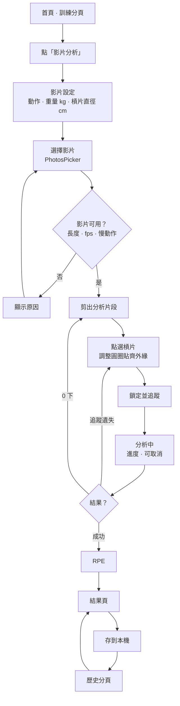
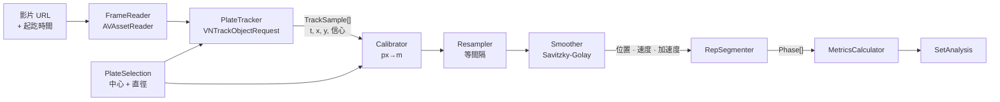
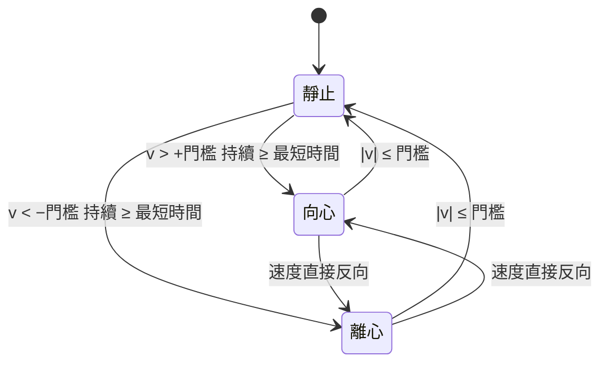
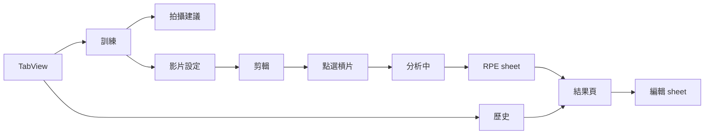

# 流程圖

## 使用者流程（MVP）

```mermaid
flowchart TD
  A["首頁 · 訓練分頁"] --> B["點「影片分析」"]
  B --> C["影片設定<br/>動作 · 重量 kg · 槓片直徑 cm"]
  C --> D["選擇影片<br/>PhotosPicker"]
  D --> E{"影片可用？<br/>長度 · fps · 慢動作"}
  E -- 否 --> E2["顯示原因"] --> D
  E -- 是 --> F["剪出分析片段"]
  F --> G["點選槓片<br/>調整圓圈貼齊外緣"]
  G --> H["鎖定並追蹤"]
  H --> I["分析中<br/>進度 · 可取消"]
  I --> J{"結果？"}
  J -- 追蹤遺失 --> G
  J -- 0 下 --> F
  J -- 成功 --> K["RPE"]
  K --> L["結果頁"]
  L --> M["存到本機"]
  M --> N["歷史分頁"]
  N --> L
```

## 分析管線

```mermaid
flowchart LR
  V["影片 URL<br/>+ 起訖時間"] --> R["FrameReader<br/>AVAssetReader"]
  R --> T["PlateTracker<br/>VNTrackObjectRequest"]
  S["PlateSelection<br/>中心 + 直徑"] --> T
  S --> C
  T -->|"TrackSample[]<br/>t, x, y, 信心"| C["Calibrator<br/>px→m"]
  C --> RS["Resampler<br/>等間隔"]
  RS --> F["Smoother<br/>Savitzky-Golay"]
  F -->|"位置 · 速度 · 加速度"| G["RepSegmenter"]
  G -->|"Phase[]"| M["MetricsCalculator"]
  M --> O["SetAnalysis"]
```

## 次數切分狀態機

```mermaid
stateDiagram-v2
  [*] --> 靜止
  靜止 --> 向心: v > +門檻 持續 ≥ 最短時間
  靜止 --> 離心: v < −門檻 持續 ≥ 最短時間
  向心 --> 靜止: |v| ≤ 門檻
  離心 --> 靜止: |v| ≤ 門檻
  向心 --> 離心: 速度直接反向
  離心 --> 向心: 速度直接反向
```

## 畫面導覽

```mermaid
flowchart LR
  Tab["TabView"] --> Train["訓練"]
  Tab --> Hist["歷史"]
  Train --> Tips["拍攝建議"]
  Train --> Setup["影片設定"] --> Trim["剪輯"] --> Select["點選槓片"] --> Prog["分析中"] --> RPE["RPE sheet"] --> Result["結果頁"]
  Hist --> Result
  Result --> Edit["編輯 sheet"]
```
